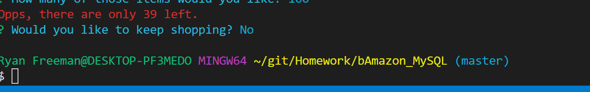

# bAmazon_MySQL
For this assignment, we were tasked with creating a MySql database for a hypothetical amazon.com-like website. We also had to create a CLI program that would allow the user to purchase items from the store.

## Technologies Used:
- MySql 
- MySql Workbench
- Node.js
- Chalk and Columnify to help with the appearance of the CLI application.

## Node Dependencies: 
- mysql
- dotenv
- inquirer
- nodemon
- chalk
- columnify

## Please see the following screen shots for a preview of how the application works

To start, you are show the list of items available for purchase. 
- 

Next, type in the ID of the product you would like to buy, and how many you would like to buy.
- 

If all goes well, the app will tell you that you bought the items, calculate your total cost, and ask if you would like to continue.
- 

The database it updated to show that two items have been purchased.
- 

If you were to try to purchase more than was available, the app will tell you that you cannot purchase that many of the item.
- 

Selecting No, at the end of your action will exit the application
- 

